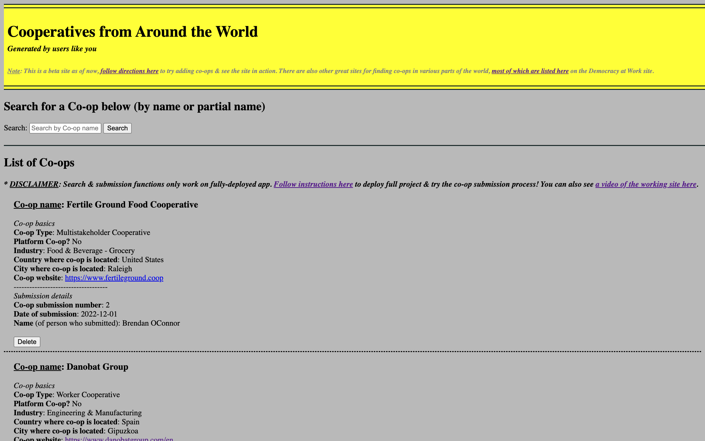

# Screenshot & Video demo

See a **sample of the main screen** below, and click the image to jump to a brief video demo:

# Description

**I am a big fan of co-ops.** This project is a beta site for _a user-generated, global directory of cooperatives_--see the sample site deployed at [bhoconnor.github.io/coop-directory](https://bhoconnor.github.io/coop-directory), but note you will need to follow instructions below to see the full working project (which utilizes a SQLite database, node.js, etc.).

As noted above, you can also see [a video of the working site here](https://youtu.be/y9jDOc69r_g)</a>.

There are various other useful sites for finding co-ops as well; most of those directories are listed on this Democracy at Work site: [www.democracyatwork.info/finding_co_ops](https://www.democracyatwork.info/finding_co_ops)

# Prerequisites for running

Install npm & Node.js [(details here)](https://docs.npmjs.com/downloading-and-installing-node-js-and-npm)

# Instructions to run

1. In terminal, run `npm install`
2. In terminal, run `npm start`
3. In browser navigate to http://localhost:3000
4. In browser add a new co-op, then new tab will open
5. Close new tab, then refresh original window
6. Click Delete to remove a co-op
7. Search for co-ops using any part of their name
